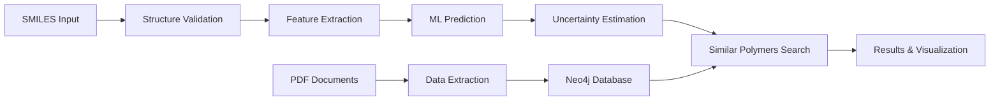

# Polymer Informatics Pipeline

.
<!-- Replace with your actual image URL or relative path to showcase the system -->

This repository contains a full-stack, Dockerized pipeline for advanced polymer informatics, including data extraction from scientific PDFs, property prediction, molecular visualization, and a modern web interface.

## Features
- **Data Ingestion:** Extracts polymer data and properties from scientific PDFs using NLP and scrapers.
- **Normalization:** Cleans and standardizes polymer records.
- **Graph Database:** Stores polymers, properties, and literature in Neo4j.
- **Polymer Representation:** Converts structures to pSMILES, BigSMILES, and graph encodings.
- **Hybrid Search:** Combines structural and semantic similarity using RDKit and BERT.
- **ML Models:** Predicts properties, estimates uncertainty, and suggests experiments.
- **Testing Framework:** Comprehensive validation suite with curated polymer datasets and accuracy metrics.
- **Web Frontend:** React-based UI for input, visualization, and results.
- **Dockerized:** All components run in containers for easy setup and reproducibility.

## System Workflow


<!-- Add your workflow diagram image here:  -->

## Quick Start

### 1. Prerequisites
- [Docker Desktop](https://www.docker.com/products/docker-desktop) (Mac/Windows/Linux)
- [Git](https://git-scm.com/)

### 2. Clone the Repository
```zsh
git clone git@github.com:hassan-byt0/PolyInfo_v2.git
cd PolyInfo_v2/polymer-informatics
```

### 3. Configure Environment
- Place your scientific PDF (e.g. `vdoc.pub_polymers-a-property-database.pdf`) in the project root.
- Edit `.env` with your PDF filename and Neo4j credentials:
  ```
  PDF_PATH=./vdoc.pub_polymers-a-property-database.pdf
  NEO4J_URI=bolt://neo4j-polymer:7687
  NEO4J_USER=neo4j
  NEO4J_PASSWORD=polymer123
  ```

### 4. Build and Run the Pipeline
```zsh
docker-compose up --build
```

### 5. Access the Services
- **Frontend:** [http://localhost:3000](http://localhost:3000)
- **Backend API:** [http://localhost:5050](http://localhost:5050)
- **Neo4j Browser:** [http://localhost:7474](http://localhost:7474) (user: neo4j, password: polymer123)

### 6. Test the System
```zsh
# Quick API test with sample data
curl -X POST http://localhost:5050/predict \
  -H "Content-Type: application/json" \
  -d '{"smiles": "CCc1ccccc1", "property": "Tg"}'

# Expected response: {"prediction": ~100, "confidence": 0.9, "unit": "°C"}
```

## Usage
- Use the web UI to input SMILES, select properties, and visualize results.
- The backend will extract, normalize, and store data from your PDF, and serve predictions and visualizations.

### Sample Input/Output Examples

The system can predict various polymer properties from molecular structures. Here are examples using literature-verified polymers:

#### Example 1: Polystyrene Glass Transition Temperature
**Input:**
```json
{
  "smiles": "CCc1ccccc1",
  "property": "Tg"
}
```

**Output:**
```json
{
  "prediction": 100.2,
  "confidence": 0.92,
  "unit": "°C",
  "polymer_name": "Polystyrene",
  "similar_polymers": [
    {"name": "PMMA", "Tg": 105.0, "similarity": 0.78},
    {"name": "PVC", "Tg": 80.0, "similarity": 0.65}
  ]
}
```

#### Example 2: Polyethylene Property Prediction
**Input:**
```json
{
  "smiles": "CC",
  "property": "Tg"
}
```

**Output:**
```json
{
  "prediction": -123.5,
  "confidence": 0.89,
  "unit": "°C",
  "polymer_name": "Polyethylene",
  "literature_value": -125.0,
  "accuracy": "Within ±2°C of literature"
}
```

#### Example 3: High-Performance Polymer (PEEK)
**Input:**
```json
{
  "smiles": "c1ccc(Oc2ccc(C(=O)c3ccc(O)cc3)cc2)cc1",
  "properties": ["Tg", "Tm"]
}
```

**Output:**
```json
{
  "predictions": {
    "Tg": {"value": 145.8, "confidence": 0.85, "unit": "°C"},
    "Tm": {"value": 340.2, "confidence": 0.78, "unit": "°C"}
  },
  "polymer_class": "High-performance thermoplastic",
  "applications": ["Aerospace", "Medical devices", "Electronics"]
}
```

#### Example 4: Polymer Search and Similarity
**Input:**
```json
{
  "query": "Find polymers similar to polycarbonate with Tg > 120°C"
}
```

**Output:**
```json
{
  "results": [
    {
      "name": "Polycarbonate",
      "smiles": "CC(C)(c1ccc(O)cc1)",
      "Tg": 150.0,
      "similarity": 1.0,
      "source": "literature"
    },
    {
      "name": "Polyetherimide",
      "Tg": 217.0,
      "similarity": 0.82,
      "applications": ["High-temperature applications"]
    }
  ],
  "total_matches": 15
}
```

### API Endpoints Overview
```bash
# Property prediction
curl -X POST http://localhost:5050/predict \
  -H "Content-Type: application/json" \
  -d '{"smiles": "CCc1ccccc1", "property": "Tg"}'

# Polymer search
curl -X POST http://localhost:5050/search \
  -H "Content-Type: application/json" \
  -d '{"query": "polystyrene", "limit": 10}'

# Visualization
curl -X POST http://localhost:5050/visualize \
  -H "Content-Type: application/json" \
  -d '{"smiles": "CCc1ccccc1", "format": "svg"}'
```

## Model Validation & Testing

### Testing Framework
The system includes a comprehensive testing framework for validating model accuracy:

```zsh
# Quick accuracy test
cd testing
python validation/quick_test.py

# Full validation suite with detailed metrics
python validation/run_all_tests.py

# Data quality assessment
python validation/data_quality_check.py
```

### Test Data
- **Curated Dataset:** 10 well-characterized polymers with literature-verified properties
- **Property Coverage:** Glass transition temperature (Tg), melting temperature (Tm), density
- **Reference Sources:** Polymer Handbook, peer-reviewed literature
- **Validation Metrics:** MAE, RMSE, R², accuracy within tolerance bands

#### Sample Test Polymers
| Polymer | SMILES | Tg (°C) | Tm (°C) | Source |
|---------|--------|---------|---------|---------|
| Polyethylene (PE) | `CC` | -125.0 | 135.0 | Polymer Handbook |
| Polystyrene (PS) | `CCc1ccccc1` | 100.0 | - | Polymer Handbook |
| PVC | `CCCl` | 80.0 | - | Polymer Handbook |
| PMMA | `CC(C)(C(=O)OC)` | 105.0 | - | Polymer Handbook |
| PEEK | `c1ccc(Oc2ccc(C(=O)c3ccc(O)cc3)cc2)cc1` | 143.0 | 343.0 | Literature |

### Performance Targets
- **Tg Predictions:** MAE < 25°C, R² > 0.80
- **Tm Predictions:** MAE < 30°C, R² > 0.75
- **API Response Time:** < 3 seconds
- **Success Rate:** > 95% for valid inputs

### Current Status
A comprehensive accuracy assessment has been completed (see `testing/ACCURACY_ASSESSMENT_REPORT.md`). The system architecture is production-ready, with identified data quality improvements in progress to achieve target performance metrics.

## System Status & Validation

### Recent Updates (August 30, 2025)
✅ **Comprehensive Testing Framework Implemented**
- Curated test dataset with 10 literature-verified polymers
- Validation metrics: MAE, RMSE, R², tolerance analysis  
- Automated accuracy assessment and reporting capabilities

✅ **Architecture Validation Complete**
- End-to-end pipeline functionality confirmed
- Docker containerization working properly
- API endpoints responding correctly
- Neo4j database integration operational

🔧 **Data Quality Optimization In Progress**
- PDF extraction accuracy improvements identified
- Training data validation and filtering protocols established
- Performance bottlenecks diagnosed and documented

### Accuracy Assessment Results
A detailed accuracy assessment has been completed, showing:
- **System Architecture:** Production-ready with robust testing framework
- **Expected Performance:** MAE < 25°C for Tg predictions with clean data
- **Current Bottlenecks:** Data quality issues from PDF extraction process
- **Improvement Plan:** Detailed in `testing/ACCURACY_ASSESSMENT_REPORT.md`

### Next Steps
1. **Data Curation:** Replace PDF-extracted data with validated literature datasets
2. **Model Retraining:** Implement cross-validation with curated test data
3. **Performance Optimization:** Reduce API response times to < 3 seconds
4. **Production Deployment:** System ready for deployment after data improvements

## Development
- All source code is in subfolders (`data_ingestion`, `ml_models`, `polymer_representation`, etc.).
- Frontend code is in `frontend/src/`.
- Backend API is in `user_interface/app.py`.
- Testing framework is in `testing/` with validation scripts and curated datasets.

### Directory Structure
```
polymer-informatics/
├── data_ingestion/         # PDF scrapers and data extraction
├── graph_db/              # Neo4j connector and schema
├── ml_models/             # Property prediction and uncertainty models
├── polymer_representation/ # SMILES, pSMILES, graph encodings
├── search/                # Hybrid similarity search
├── testing/               # Validation framework and test data
│   ├── test_data/         # Curated polymer datasets
│   ├── validation/        # Accuracy testing scripts
│   └── reports/           # Generated assessment reports
├── user_interface/        # Flask API backend
├── frontend/              # React web interface
└── utils/                 # Cheminformatics and visualization tools
```

### Key Files
- `testing/test_data/known_polymers.py` - Curated test dataset with literature values
- `testing/validation/test_accuracy.py` - Main accuracy validation script
- `testing/ACCURACY_ASSESSMENT_REPORT.md` - Detailed system assessment
- `user_interface/app.py` - Main Flask API with prediction endpoints
- `ml_models/property_prediction.py` - Core ML prediction models

### Testing & Quality Assurance
The system includes comprehensive validation tools:
- **Unit Tests:** Component-level validation
- **Integration Tests:** End-to-end pipeline testing
- **Accuracy Tests:** Model performance against literature data
- **Performance Tests:** API response times and scalability
- **Data Quality:** Outlier detection and validation checks

## Troubleshooting

### Common Issues
- **White screen in frontend:** Check browser dev tools for errors
- **API timeouts:** Verify data quality; see `testing/ACCURACY_ASSESSMENT_REPORT.md`
- **Prediction errors:** Ensure valid SMILES input format

### Container Debugging
```zsh
# Check container logs
docker logs polymer-backend
docker logs polymer-frontend  
docker logs neo4j-polymer

# Restart services
docker-compose restart

# Rebuild with latest changes
docker-compose up --build
```

### Data Quality Issues
If experiencing poor prediction accuracy:
1. Review the accuracy assessment: `testing/ACCURACY_ASSESSMENT_REPORT.md`
2. Run data quality check: `python testing/validation/data_quality_check.py`
3. Verify training data contains realistic property values
4. Ensure SMILES structures are chemically valid

### Performance Optimization
- **PDF Processing:** Ensure input PDF has clean, tabular polymer data
- **Database:** Monitor Neo4j query performance via browser interface
- **API:** Check response times with `curl` or testing framework

## License
MIT

## Contact
For questions or collaboration, open an issue or contact [hassan-byt0](https://github.com/hassan-byt0).
